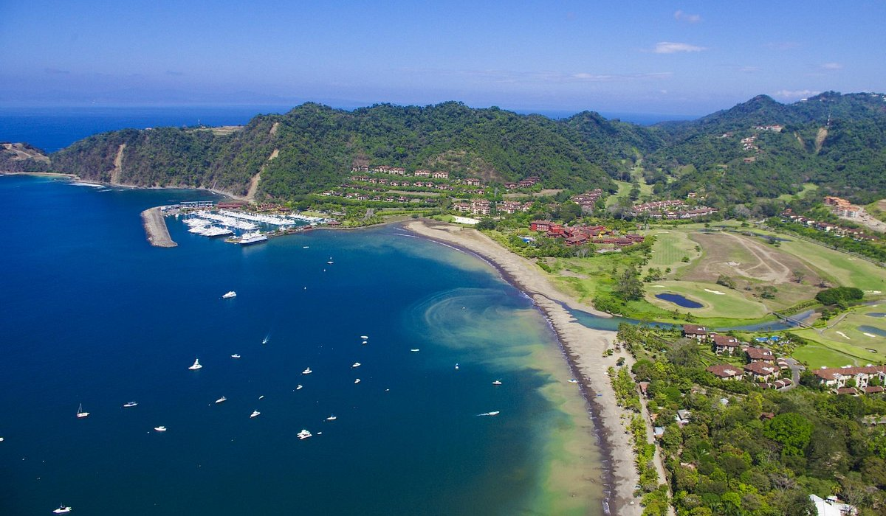

 <!-- 🏷️ Badges informativos del proyecto -->

# 🌊 Análisis Espectral de la Marea en Bahía Herradura 🌊
## Descripción del proyecto
    El presente proyecto propone realizar un análisis espectral de la marea del Océano Pacífico de Costa Rica, específicamente 
    en Bahía Herradura. Esto mediante el uso de métodos de análisis armónico y trasnformadas rápidas de Fourier (FFT).
    Se busca identificar las principales componentes armónicas y discutir sus posibles aplicaciones en dinámica costera,
    además de realizar predicciones del nivel del mar.
    "If you can not explain it simply, you do not understand it well enough" -Albert Einstein
## 📘 Contenidos
1. [Introducción](#-introducción)
2. [Metodología](#-metodología)
3. [Resultados](#-resultados)
4. [Estructura del repositorio](#-estructura-del-repositorio)
5. [Ejemplo de ejecución](#-ejemplo-de-ejecución)
6. [Créditos](#-créditos)
## Introducción

